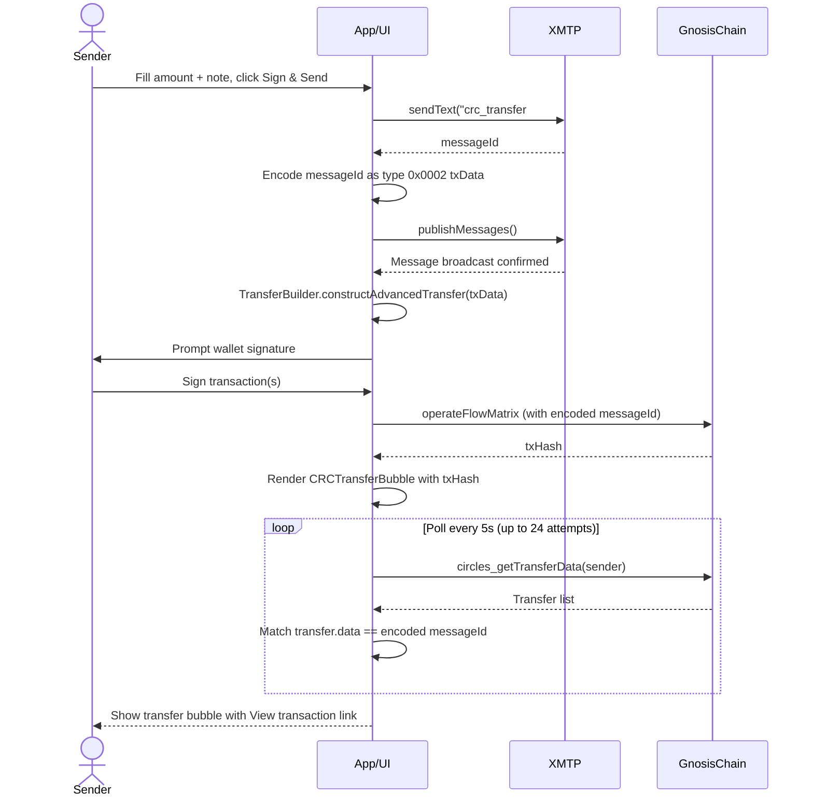
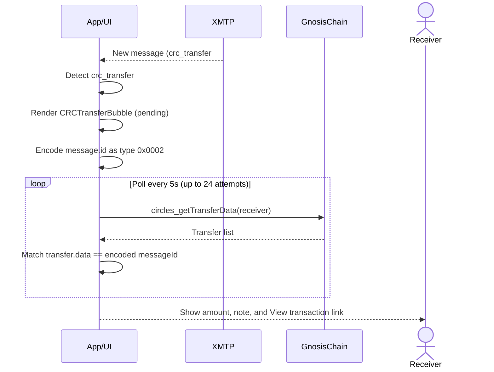

# XMTP Circles Mini App

A fully-functional XMTP chat application with integrated wallet connection, real-time messaging, and Circles integration capabilities.

## Guide

1. Onboarding

   <video src="https://github.com/zengzengzenghuy/xmtp-circles-miniapp/raw/main/static/video/onboard.mp4" width="300" controls></video>
   

2. Send CRC in your chat

   <video src="https://github.com/zengzengzenghuy/xmtp-circles-miniapp/raw/main/static/video/sendtx.mp4" width="300" controls></video>
   

## Setup

### Prerequisites

- Node.js 16+ and npm
- A Web3 wallet (MetaMask or WalletConnect-compatible)
- WalletConnect Project ID (free from [cloud.walletconnect.com](https://cloud.walletconnect.com/))

### Installation

1. **Clone and install dependencies:**

```bash
npm install
```

2. **Create environment file:**

```bash
cp .env.example .env
```

3. **Configure WalletConnect:**
   - Get a Project ID from [https://cloud.walletconnect.com/](https://cloud.walletconnect.com/)
   - Add it to `.env`:
   ```
   VITE_WALLETCONNECT_PROJECT_ID=your_project_id_here
   ```

### Development

Run the development server:

```bash
npm run dev
```

The app will be available at `http://localhost:5182`

### Building for Production

```bash
npm run build
```

The production build will be in the `dist/` directory.

## Getting Started

### How to Use

1. **Connect Wallet**
   - Click the **Account** tab at the bottom
   - Click **Connect** tab
   - Choose MetaMask or WalletConnect
   - Approve the connection in your wallet

2. **Create XMTP Inbox**
   - After wallet connection, click **Activate XMTP Inbox**
   - Sign the message in your wallet to create your XMTP identity
   - Your inbox ID will be registered on xmtp network

3. **Start a Conversation**
   - Go to the **Message** tab
   - Click the **+** button
   - Enter a recipient's Ethereum address (must be registered on XMTP network & Circles avatar)
   - Send your first message

4. **Configure Settings**
   - Go to **Account** tab → **Settings** tab

### Browser Compatibility

**Recommended Browsers**: Chrome, Firefox, Edge

**Brave Users**: Not available, Brave blocks xmtp from storing database in OPFS.

## Data Storage & Privacy

### Local Storage

The app stores the following data locally in your browser:

- **XMTP Inbox ID**: Mapped to your wallet address (`xmtp-inbox-{address}`)

### OPFS (Origin Private File System)

XMTP Browser SDK uses OPFS to store:

- Conversation data
- Message history
- Encryption keys
- Member information

### Privacy

- All data is stored locally in your browser
- No data is sent to external servers (except XMTP network nodes)
- Messages are end-to-end encrypted via XMTP protocol
- Clearing browser data will reset your local state (inbox ID can be recovered by reconnecting)

## Architecture

### Core Files

- **`src/App.jsx`** - Main application with XMTP client management, conversation syncing, and tab navigation
- **`src/config/wagmi.js`** - Wagmi configuration for Gnosis Chain
- **`src/main.jsx`** - App entry point with WagmiProvider and QueryClientProvider

### Components

- **`src/components/AccountPage.jsx`** - Wallet connection and XMTP inbox management with Settings tab
- **`src/components/ConversationList.jsx`** - Conversation list with refresh and new conversation buttons
- **`src/components/MessageArea.jsx`** - Message display, filtering, and sending
- **`src/components/BottomTabs.jsx`** - Bottom navigation for Chat, Arcade, and Account tabs
- **`src/components/NewConversationModal.jsx`** - Modal for creating new conversations

### State Management

- **`src/stores/inboxStore.js`** - Zustand store for conversations, messages, and metadata
- **`src/stores/inboxHooks.js`** - Custom hooks for accessing store state

### Custom Hooks

- **`src/hooks/useConversations.js`** - Conversation management (sync, create, stream)
- **`src/hooks/useConversation.js`** - Individual conversation operations (messages, send)

### Helpers

- **`src/helpers/createSigner.js`** - EOA and SCW signer creation for XMTP

### Styling

- **`src/styles.css`** - Complete application styling with responsive design

## Technical Details

### State Management

- **Zustand** for global state management
- **localStorage** for persistence of inbox IDs and settings
- Efficient message and conversation caching

### XMTP Integration

- **Environment**: Configurable (dev/production) via Account > Settings
- **Storage**: OPFS for XMTP data
- **Streaming**: Real-time conversation and message updates
- **Members**: Extracts Ethereum addresses from member accountIdentifiers

### Message Handling

- Filters system messages (membership updates, etc.)
- Displays only user-sent text messages
- Shows timestamps in local time
- Proper sent/received styling
- Transfer CRC with note

## CRC Transfer with Note

### Why It Matters

Send money and a message — privately. CRC Transfer with Note lets you attach a personal note to every Circles transfer, but unlike traditional payment apps where memos are visible to the platform or stored in plain text on-chain, your note is protected by **Message Layer Security (MLS)** through XMTP. Only you and the recipient can read it; the on-chain record contains nothing but an opaque `messageId`. Even if someone inspects the transaction on Gnosis Chain, they see a 32-byte identifier with no way to decrypt or link it back to the message content. This means you get the convenience of annotated payments — split bills, birthday gifts, DAO contributions — without sacrificing the financial privacy that Circles is built on.

### What You Can Do

Inside any 1-on-1 conversation, tap the **+** button in the composer bar to open the action menu. Select **Transfer CRC** to send Circles (CRC) tokens directly to the person you are chatting with.

- The **To** field pre-fills with the recipient's Circles username (or raw address if they have no profile) and is read-only.
- A **Send Limit** shows the maximum CRC transferable along the trust path between you and the recipient, queried live from the Circles network.
- Enter a **Value** (capped at the send limit) and an optional **Note** — the note is recorded on both the XMTP message and linked to the on-chain transaction.
- Click **Sign & Send** to approve the transaction in your wallet. Once confirmed, both you and the recipient see a dedicated transfer message with a link to the transaction on Gnosis Chain.

### Technical Workflow

#### Sender side

> > In this implementation, we append `crc_transfer#` in front of normal message content as a indicator for App/UI to process the transfer message correctly on the UI instead of rendering the raw message.

1. **XMTP send** — `conversation.sendText("crc_transfer# {...}", true)` publishes an optimistic message to the local store and returns a `messageId` before the transaction is broadcast.
2. **messageId encoding** — The `messageId` is encoded as a Circles SDK type `0x0002` payload (`0x0100020020` + 32-byte hex) and passed as `txData` to `TransferBuilder.constructAdvancedTransfer()`. This links the on-chain transaction to the XMTP message.
3. **On-chain transfer** — The Circles SDK `TransferBuilder` constructs the transfer transactions (including path resolution), which culminate in an `operateFlowMatrix` call on the Circles V2 Hub (`0xc12C1E50ABB450d6205Ea2C3Fa861b3B834d13e8`, Gnosis chain). For SCW (Safe) wallets the transactions are batched via `sendBatchTransactions`; for EOA wallets they are sent sequentially and the `operateFlowMatrix` tx hash (selector `0x0d22d9b5`) is picked as the canonical hash to be rendered on the Converstation UI.
4. **XMTP publish** — `conversation.publishMessages()` is called **before** the wallet signing step to avoid intent TTL expiry (the signing step can take 30+ seconds). Both XMTP calls are wrapped in `try-catch` so a node failure cannot block the on-chain transaction.
5. **Tx hash recovery** — After the transaction completes, the sender's bubble polls `circles_getTransferData` (same as the receiver) to discover the real on-chain transaction hash.



#### Receiver side

1. **Message detection** — Incoming messages prefixed with `crc_transfer# ` are rendered as `CRCTransferBubble` instead of plain text.
2. **Polling for the tx hash** — The bubble message modal encodes `message.id` as type `0x0002` and polls `circles_getTransferData` every 5 seconds (up to 24 attempts, ~2 minutes) looking for a transfer whose `data` field matches the encoded messageId.
3. **Link display** — Once matched, the bubble shows the transfer amount, note, and a **View transaction ↗** link to `https://gnosisscan.io/tx/{txHash}`.



#### Component breakdown

| Layer        | Responsibility                                                                                                                                                                                                 |
| ------------ | -------------------------------------------------------------------------------------------------------------------------------------------------------------------------------------------------------------- |
| **XMTP**     | Message delivery; `messageId` used as the on-chain annotation key; `publishMessages()` broadcasts before tx is executed on chain to prevent TTL issue                                                          |
| **Circles**  | `TransferBuilder.constructAdvancedTransfer()` for pathfinding and building transfer txs; `operateFlowMatrix` on the V2 Hub for the actual transfer; `circles_getTransferData` for receiver-side tx hash lookup |
| **Frontend** | `CRCTransferFlow` modal (3-step: picker → form → confirm); `CRCTransferBubble` for rendering; deferred sender render via `crcTxHashes` map; receiver polling loop in bubble `useEffect`                        |

## Troubleshooting

### Connection Issues

**"Client.create timed out!"**

- Disable browser privacy shields/ad blockers for this site
- Try a different browser (Chrome/Firefox recommended)
- Check that OPFS is enabled in browser settings
- Clear browser cache and try again

**"Failed to load XMTP client"**

- Your browser may be blocking OPFS access
- Try disabling browser extensions temporarily
- Ensure you're not in private/incognito mode

**"Address not registered on XMTP network"**

- The recipient must have created an XMTP inbox first
- Ask them to connect to any XMTP app (like xmtp.chat) once
- Check that you entered the correct Ethereum address

### Message Issues

**Messages not appearing**

- Click the refresh button (↻) in the conversation list
- Check browser console for errors
- Verify you're connected to the same network (dev)
- [Backup or archive](https://docs.xmtp.org/chat-apps/list-stream-sync/archive-backups) should be implemented on production ready app to avoid losing message history

**Cannot send messages**

- Ensure your wallet is still connected and on Gnosis Chain.
- Check that you have an active XMTP inbox
- Verify the conversation is active

## Known Issues

- **Connection Timeout**: 60-second timeout for XMTP client creation
- **System Messages**: Automatically filtered but visible in network logs
- **First Message Delay**: Initial message in a new conversation may take a few seconds
- **Using Rabby Wallet**: Go to **Settings > Connect Rabby by Disguising as MetaMask** and try to refresh and reconnect again.

## Roadmap

- [x] Support xmtp history sync
- [x] Circles integration features
  - [x] Transfer CRC with Notes
  - [x] Only allow conversation with human and has registered on XMTP
  - [ ] Only allow dm from avatar you trust
  - [x] Circles as identifier ID
  - [x] Search receiver with Circles address
  - [x] Support search using Circles username
- [x] Compatible with Circles MiniApp
- [ ] XMTP Group chat support
- [ ] Circles group chat support
  - [ ] Show available Circles group
  - [ ] Create Circles group and add member (WIP)
  - [ ] Join existing Circles group

## Resources

- [XMTP Documentation](https://docs.xmtp.org/)
- [XMTP Browser SDK](https://github.com/xmtp/xmtp-js)
- [wagmi Documentation](https://wagmi.sh/)
