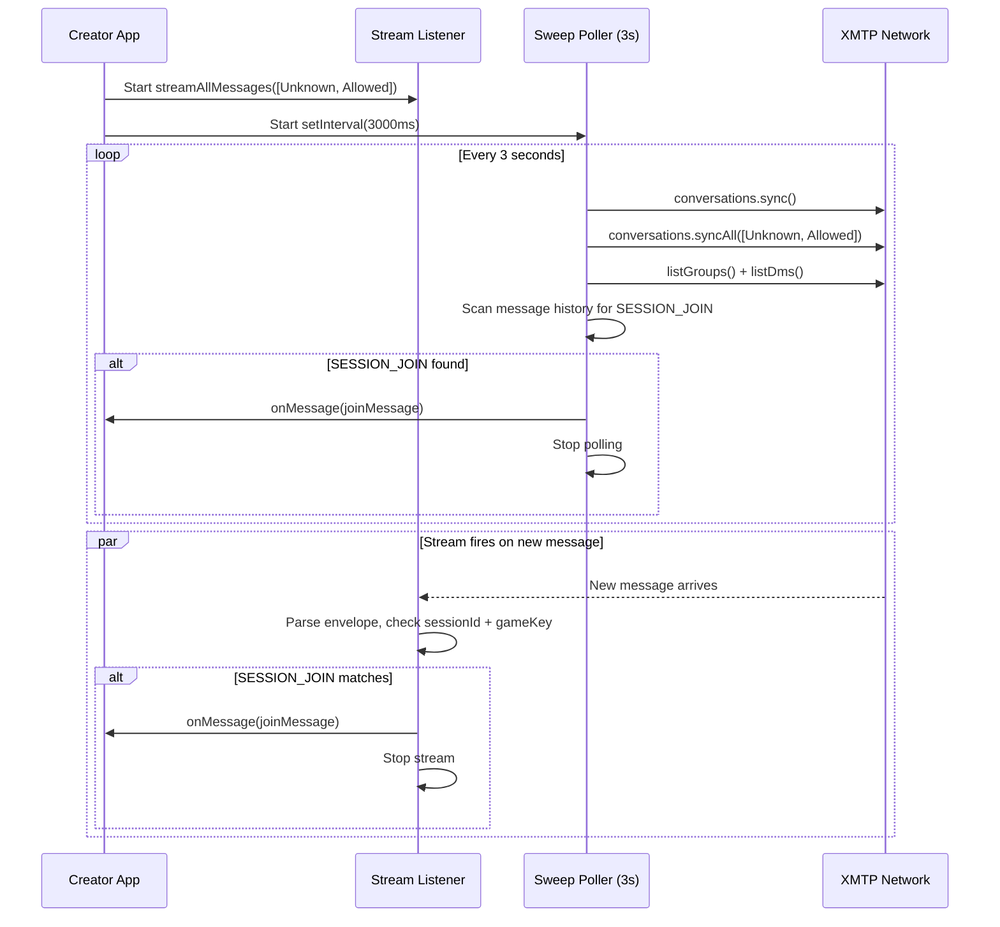
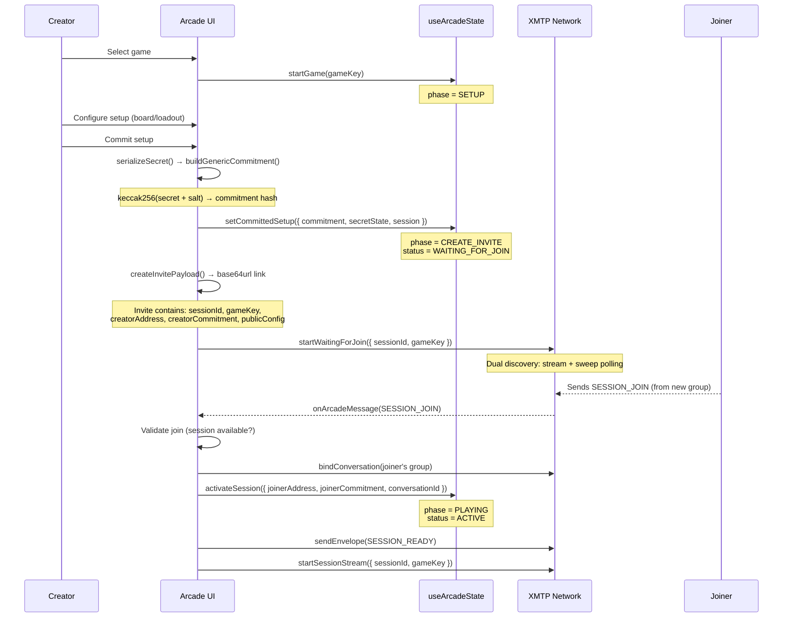
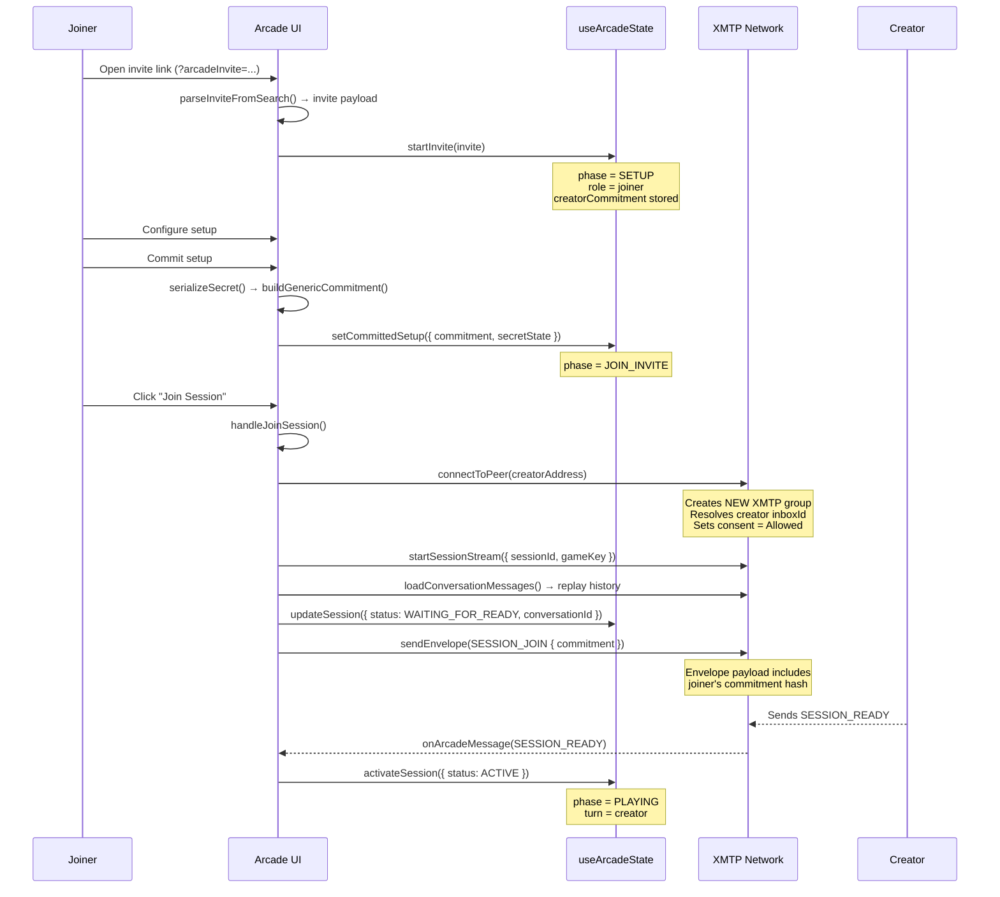
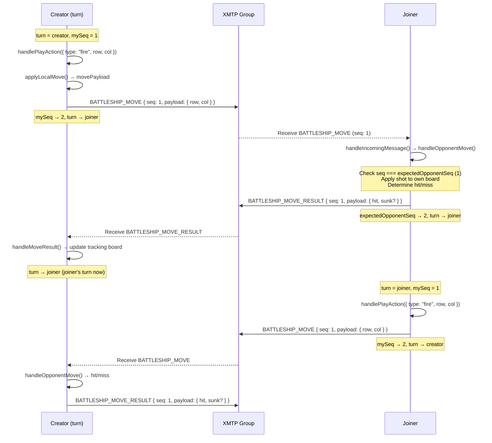
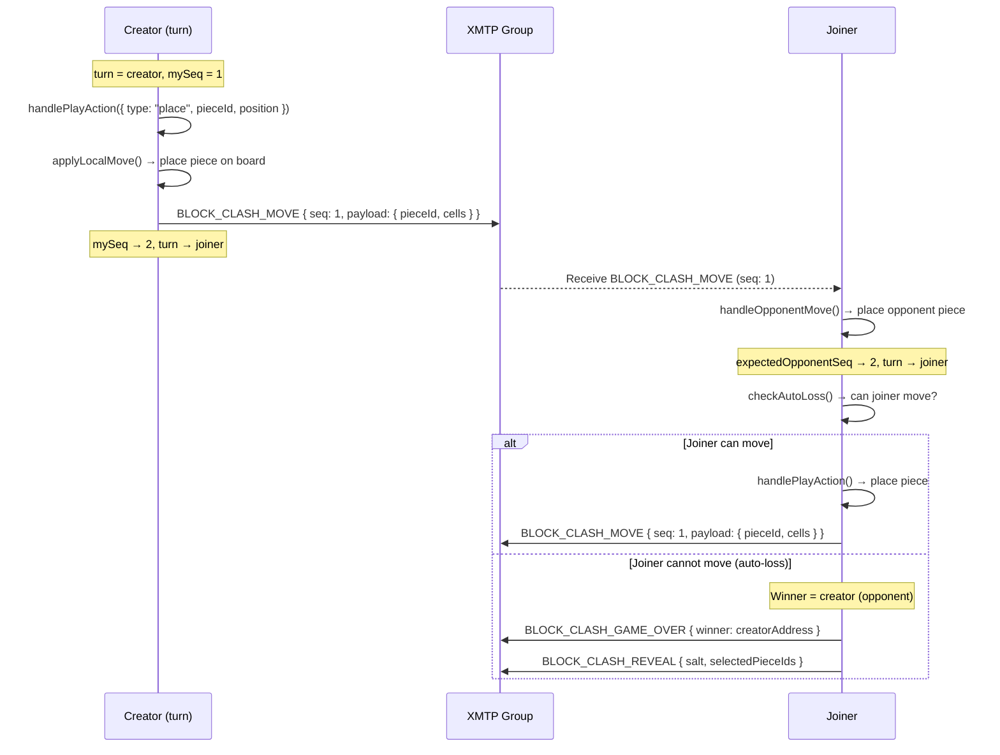
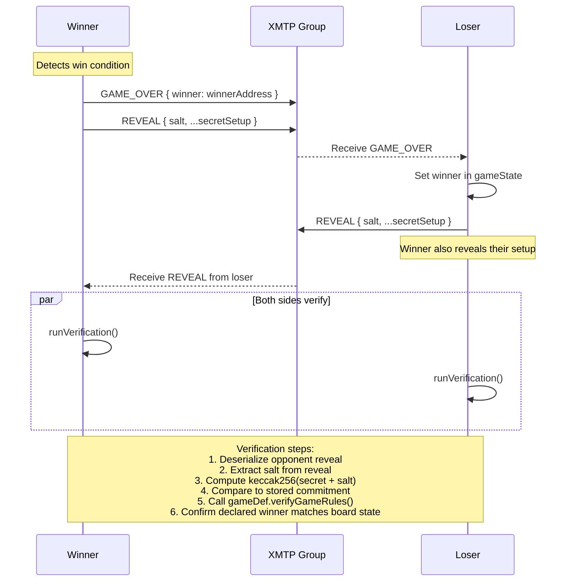
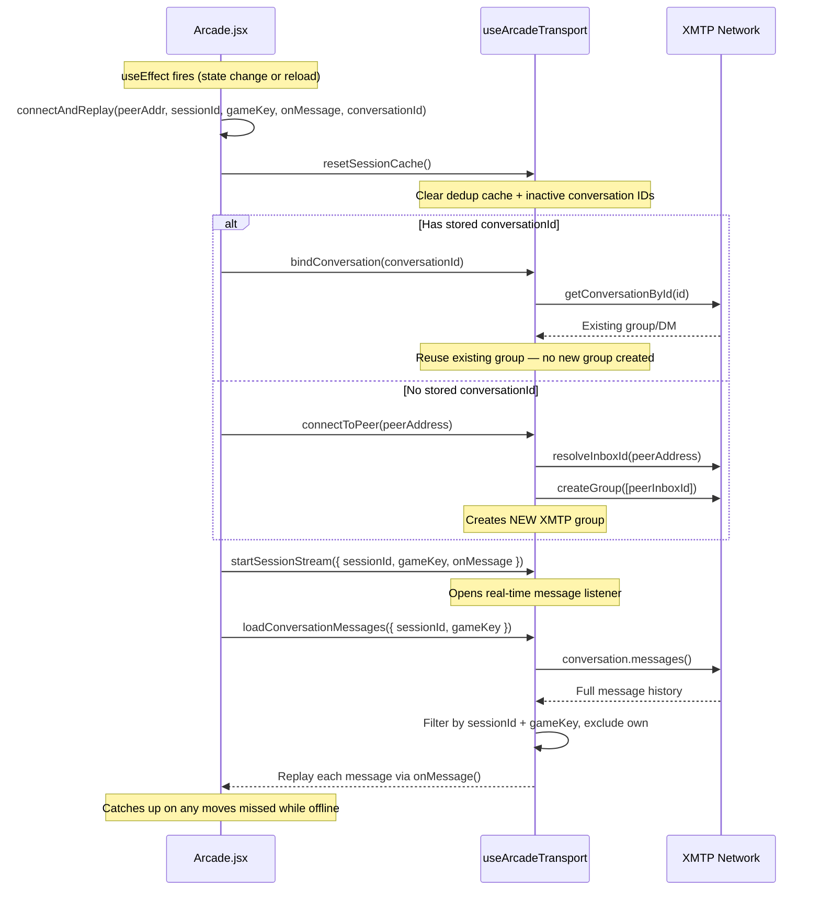

# Arcade Module

This folder contains the offchain arcade implementation used by [`src/components/Arcade.jsx`](../Arcade.jsx).

The arcade is split into a coordinator plus reusable submodules:

- `games/` — game-specific setup, play, result, and reducers
- `hooks/` — local state, XMTP transport, and payment polling
- `protocol/` — message envelopes, commitment hashing, move handling
- `helpers/` — constants, invite encoding, persistence, runtime config
- `payments/` — payment marker, transfer URL, Circles RPC lookup
- `screens/` — phase-level UI shells

## Architecture

```
┌─────────────────────────────────────────────────────────┐
│  Arcade.jsx (Coordinator)                               │
│  - Phase transitions, session lifecycle                 │
│  - Calls transport + protocol, dispatches state actions │
├──────────────┬──────────────┬───────────────────────────┤
│ useArcadeState│useArcadeTransport│ shellProtocol        │
│ State machine │ XMTP groups      │ Move/message logic   │
│ Persistence   │ Send/receive     │ Resign, verify       │
│ Recovery      │ Stream/sweep     │ Commit/reveal        │
├──────────────┴──────────────┴───────────────────────────┤
│  Game Definitions (gameRegistry.js)                     │
│  battleship, block_clash                                │
│  Each provides: setup, moves, verification, serializer  │
└─────────────────────────────────────────────────────────┘
```

### Layer Responsibilities

| Layer | File | Role |
|-------|------|------|
| Coordinator | `src/components/Arcade.jsx` | Owns phase transitions, connects transport to protocol, dispatches state |
| State | `hooks/useArcadeState.js` | Reducer-based state machine, localStorage persistence, recovery |
| Transport | `hooks/useArcadeTransport.js` | XMTP group creation, message send/receive, streaming, history replay |
| Protocol | `protocol/shellProtocol.js` | Generic move handling, resign, game-over, reveal, verification |
| Envelope | `protocol/envelope.js` | Message format, type helpers |
| Commitment | `protocol/commitment.js` | keccak256 commit/reveal scheme |
| Games | `games/*/index.js` | Game-specific rules, moves, verification |

---

## XMTP Transport

Transport is isolated in [`hooks/useArcadeTransport.js`](hooks/useArcadeTransport.js). The arcade uses its own XMTP connection separate from the chat inbox.

### Group Creation vs Binding

| Method | When Used | Effect |
|--------|-----------|--------|
| `connectToPeer(address)` | First connection (joiner creates group to reach creator) | Creates a **new XMTP group**, syncs, sets consent to Allowed |
| `bindConversation(id)` | Reconnection (stored `conversationId` exists) | Retrieves **existing** group by ID, no new group created |

The coordinator stores `conversationId` in session state after the first connection. On reconnect (app reload, useEffect re-fire), it passes this ID to `bindConversation` to avoid creating duplicate groups.

### Dual Discovery (Creator Waiting for Join)

When the creator is waiting for a joiner, `startWaitingForJoin()` uses two parallel discovery mechanisms:



**Why dual?**
- **Stream** — fast real-time response when XMTP push works
- **Sweep** — fallback that polls every 3 seconds, handles missed messages and MLS welcome message delays

### Message Filtering

All incoming messages pass through filters:
- **Version check** — must be `arcade/v1`
- **Self-filter** — own messages (by address) are ignored
- **Deduplication** — `seenMessageKeysRef` tracks `sessionId:type:seq:from` keys
- **Session filter** — must match current `sessionId` and `gameKey`

---

## Envelope Protocol

All arcade messages use the format defined in [`protocol/envelope.js`](protocol/envelope.js).

### Envelope Shape

```json
{
  "version": "arcade/v1",
  "sessionId": "0xabc123:uuid-4567",
  "gameKey": "battleship",
  "type": "SESSION_JOIN",
  "seq": 0,
  "from": "0x1234...abcd",
  "payload": {}
}
```

### Message Types

**Lifecycle** (defined in `helpers/constants.js`):

| Type | Sender | Purpose |
|------|--------|---------|
| `SESSION_JOIN` | Joiner | Sends commitment to creator, requests to join |
| `SESSION_READY` | Creator | Confirms joiner accepted, game can start |
| `SESSION_JOIN_REJECTED` | Creator | Rejects joiner (session unavailable) |

**Game-specific** (derived from game definition):

| Type Pattern | Example | Purpose |
|--------------|---------|---------|
| `{game}_move` | `battleship_move` | Player's move (shot, piece placement) |
| `{game}_move_result` | `battleship_move_result` | Response to move (hit/miss) — optional |
| `{GAME}_GAME_OVER` | `BATTLESHIP_GAME_OVER` | Declares winner, ends game |
| `{GAME}_REVEAL` | `BATTLESHIP_REVEAL` | Reveals secret setup for verification |

### Sequencing

Two counters prevent replay and ordering issues:
- `mySeq` — incremented with each outgoing move
- `expectedOpponentSeq` — incoming moves are rejected if `seq !== expectedOpponentSeq`

---

## Session Flows

### Creator Flow (Free Mode)



### Joiner Flow (Free Mode)



### Gameplay: Request-Response (Battleship)



### Gameplay: Fire-and-Forget (Block Clash)



### Game Over and Verification



### Reconnection Flow



---

## Commit / Reveal Model

Commitment helpers live in [`protocol/commitment.js`](protocol/commitment.js).

```
Setup Phase:
  1. Player configures secret setup (board placement, loadout)
  2. Game serializes secret → Uint8Array
  3. Generate random 32-byte salt
  4. commitment = keccak256(secretBytes + salt)
  5. Commitment shared publicly via invite or SESSION_JOIN

Game End:
  6. Each side sends REVEAL { salt, ...secretData }
  7. Opponent recomputes keccak256(revealedSecret + revealedSalt)
  8. Compared to stored commitment — mismatch = contested
  9. gameDef.verifyGameRules() validates move legality
```

This allows post-game honesty verification without any onchain escrow.

---

## Session State Machine

State is managed by [`hooks/useArcadeState.js`](hooks/useArcadeState.js) via `useReducer`.

### Session Status Transitions

```
Creator:  DRAFT → WAITING_FOR_JOIN → ACTIVE → RESULT
Joiner:   DRAFT → WAITING_FOR_READY → ACTIVE → RESULT
```

### Key Session Fields

| Field | Purpose |
|-------|---------|
| `sessionId` | Unique per session, created by creator |
| `gameKey` | Game identifier (`battleship`, `block_clash`) |
| `role` | `creator` or `joiner` |
| `status` | Current session status (see transitions above) |
| `conversationId` | XMTP group ID for reconnection |
| `creatorCommitment` / `joinerCommitment` | keccak256 hashes for verification |
| `turn` | Whose turn it is (`creator` or `joiner`) |
| `mySeq` / `expectedOpponentSeq` | Move sequence counters |
| `winner` | Winner address (set at game end) |

### Phase Flow (UI)

```
HOME → SETUP → CREATE_INVITE (creator) → PLAYING → RESULT
HOME → SETUP → JOIN_INVITE (joiner)   → PLAYING → RESULT

With payments:
HOME → PAYMENT_SELECT → PAYMENT_WAIT → SETUP → ...
```

---

## Supported Games

### Battleship

- **Move style:** request-response
- **Turn order:** creator starts
- Setup: private board placement, committed before invite
- Shooter sends `BATTLESHIP_MOVE` (shot coordinates)
- Defender responds with `BATTLESHIP_MOVE_RESULT` (hit/miss/sunk)
- Game ends when all ships sunk

### Block Clash

- **Move style:** fire-and-forget
- **Turn order:** creator starts
- **Board:** 7x7 grid
- Setup: select 8 pieces from catalog of 10 variations
- Player places piece → sends `BLOCK_CLASH_MOVE`
- No response needed — opponent applies placement locally
- Auto-loss: after opponent's move, if current player has no valid placement, they lose
- Game ends when a player places all pieces or gets stuck

---

## Invite Flow

Invite helpers live in [`helpers/invite.js`](helpers/invite.js).

Invite format: base64url-encoded JSON in `?arcadeInvite=...` query parameter, versioned with `arcade/v1`.

Invite payload contains:
- `sessionId`, `gameKey`
- `creatorAddress`, `creatorCommitment`
- `publicConfig` (includes billing metadata if paid mode)
- `createdAt`

---

## Payment Mode

Runtime config lives in [`helpers/config.js`](helpers/config.js).

| Env Var | Purpose |
|---------|---------|
| `VITE_ARCADE_FREE_MODE` | `true` skips payment entirely |
| `VITE_ARCADE_PAYMENT_RECIPIENT_ADDRESS` | Gnosis org address |
| `VITE_CIRCLES_RPC_URL` | Circles RPC endpoint |
| `VITE_GNOSIS_TRANSFER_BASE_URL` | Transfer URL base |
| `VITE_ARCADE_PAYMENT_POLL_INTERVAL_MS` | Payment poll interval |

**Free mode** — pure offchain game flow, no payment step.

**Paid mode** — creator pays before setup (1 or 2 CRC). Joiner can pay 1 CRC or play free. Payment marker (`arcade/v1|sessionId|role|address|amount`) is attached to Gnosis transfer URL. Confirmation is polled via Circles RPC (`circles_events` / `CrcV2_TransferData`).

Payment watcher: [`hooks/usePaymentWatcher.js`](hooks/usePaymentWatcher.js). RPC lookup: [`payments/circles.js`](payments/circles.js). Marker builder: [`payments/marker.js`](payments/marker.js). Transfer URL: [`payments/transactions.js`](payments/transactions.js).

---

## Persistence and Recovery

Persistence helpers live in [`helpers/storage.js`](helpers/storage.js).

Storage keys:
- `arcade-state/<address>/<gameKey>/<sessionId>` — full state snapshot
- `arcade-secret/<address>/<gameKey>/<sessionId>` — secret state (salt, setup)
- `arcade-active/<address>` — pointer to current session

**Recovery model:** On mount, stored state is loaded and validated. If valid, a recovery panel is shown on the home screen. The user chooses "Resume session" or "Start over." Reset is wallet-scoped: `clearAllArcadeStateForAddress(address)` removes all saved snapshots for that wallet.

---

## Result Verification

Driven by stored commitments, opponent reveal payload, and game-specific verification logic. The shell protocol calls `runVerification()` when a REVEAL message arrives:

1. Deserialize opponent's reveal payload
2. Extract and normalize salt
3. Recompute `keccak256(secret + salt)`, compare to stored commitment
4. Call `gameDef.verifyGameRules()` to validate move legality and winner
5. Update `state.verification` with `{ canConfirm, contested, reason }`

The result screen surfaces whether the final state is consistent with the committed setup.

---

## Important Files

| Role | Path |
|------|------|
| Coordinator | `src/components/Arcade.jsx` |
| State machine | `src/components/arcade/hooks/useArcadeState.js` |
| XMTP transport | `src/components/arcade/hooks/useArcadeTransport.js` |
| Shell protocol | `src/components/arcade/protocol/shellProtocol.js` |
| Envelope format | `src/components/arcade/protocol/envelope.js` |
| Commitment | `src/components/arcade/protocol/commitment.js` |
| Game registry | `src/components/arcade/gameRegistry.js` |
| Constants | `src/components/arcade/helpers/constants.js` |
| Invites | `src/components/arcade/helpers/invite.js` |
| Storage | `src/components/arcade/helpers/storage.js` |
| Config | `src/components/arcade/helpers/config.js` |
| Payment watcher | `src/components/arcade/hooks/usePaymentWatcher.js` |
| Circles RPC | `src/components/arcade/payments/circles.js` |
| Payment marker | `src/components/arcade/payments/marker.js` |
| Transfer URL | `src/components/arcade/payments/transactions.js` |
